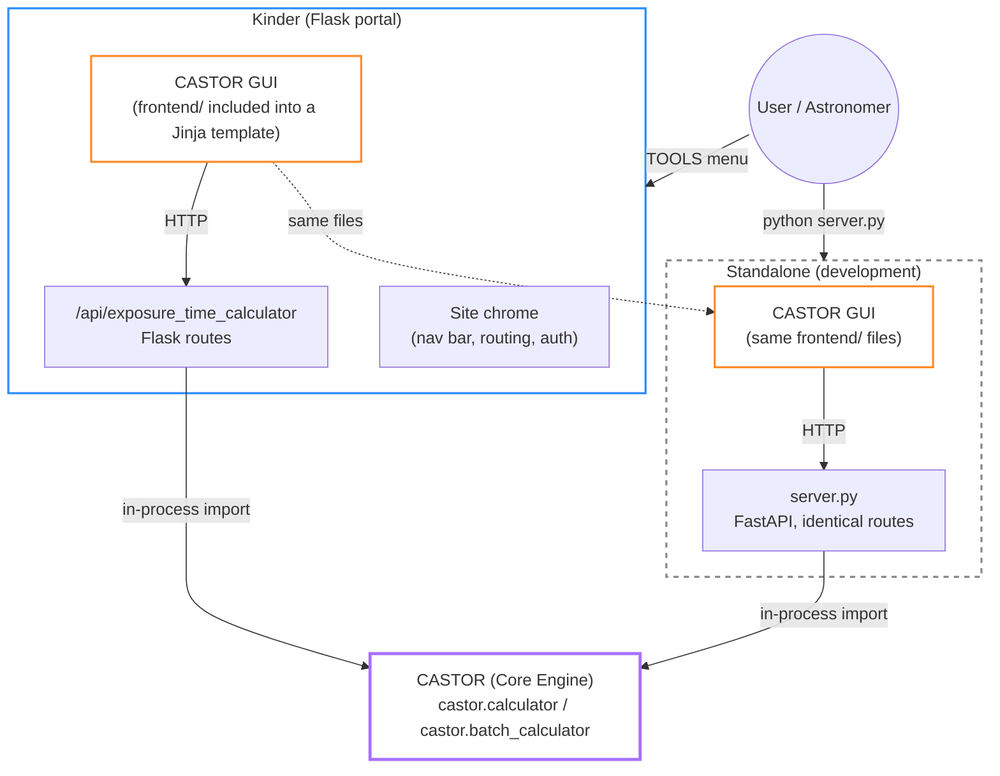
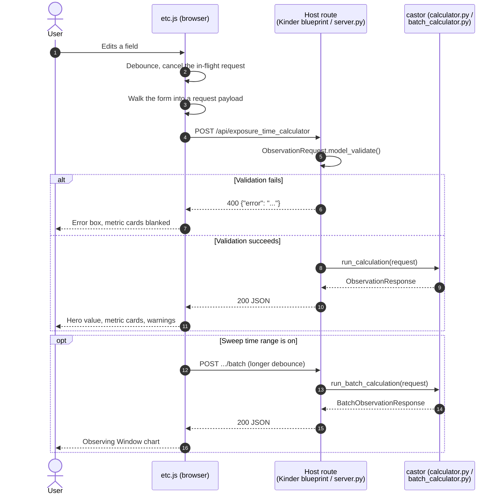

# CASTOR GUI Architecture

## 1. System Overview

### 1.1 Product Identity

CASTOR GUI is the official reference interface for the [CASTOR](architecture.md) exposure time calculator engine. It gives astronomers a form-driven UI for building an observation request (instrument, target, environment, calculation strategy), running the calculation live, and reading back the results — without writing any code or touching `castor.schema` directly.

It is plain HTML, CSS and JavaScript ([`src/castorGUI/frontend/`](../src/castorGUI/frontend/)), served either by its own small development host or by whatever site embeds it. That choice is the product decision, not an implementation detail: CASTOR GUI is meant to be **mounted inside [Kinder](https://kinder.astro.ncu.edu.tw)**, a Flask/Jinja astronomy portal with no frontend build step, and a plain HTML fragment is the only shape that a Jinja template can include natively. See [`frontend/README.md`](../src/castorGUI/frontend/README.md) for the host contract.

CASTOR GUI is a distinct product from the CASTOR core engine. It is a consumer of that engine, not part of it — see [`architecture.md` §1.3](architecture.md#13-system-context--boundary) for the engine-side boundary.

### 1.2 Core Value

Without CASTOR GUI, every consumer of the CASTOR engine has to build its own form, its own validation-error display, and its own results layout from scratch, against a Pydantic contract that changes as the engine evolves. CASTOR GUI centralizes that work once and lets Kinder include it rather than re-derive it.

That "rather than re-derive it" is the lesson the current structure exists to encode. An earlier version of this frontend was deleted when the GUI was rewritten in Flet; Kinder had already forked a copy of it, so the two immediately began to drift, with the same form maintained twice in two languages. The frontend was restored specifically so there is one copy again.

### 1.3 System Context & Boundary

Kinder vendors this repository at `app/modules/CASTOR/` and calls the engine **in-process**, exactly like any other Python caller — `from castor.calculator import run_calculation`. What crosses a network boundary is only the browser talking to Kinder's own routes.



**Chrome vs. content ownership.** Kinder owns the outer site chrome — nav bar, routing, page title, page background, and how much vertical room the calculator gets. CASTOR GUI owns the content area and nothing outside it: every CSS rule is scoped under `.castor-etc`.

Visual identity flows *from* Kinder, not the other way round. Kinder's `_theme.css` defines `--kw-accent: #C5A059`, `--kw-border`, `--kw-space-*` and the rest; [`etc.css`](../src/castorGUI/frontend/css/etc.css) reads those variables with its own fallbacks, so mounted it inherits the site's theme and standalone it still renders correctly on its own.

#### In Scope for CASTOR GUI

##### A. Request Building

* **Domain-Driven Form:** Four freely-switchable tabs — Instrument, Target, Environment, Options — mirroring the engine's four request pillars. Every `<input name="...">` is a dotted path matching `castor.schema`'s nested shape, so the request payload is built by walking the form rather than by naming each field twice.
* **Observing Setup:** Four selectors from [`data/presets.json`](../src/castorGUI/data/presets.json) — site, telescope, camera, filter. A site owns all three hardware catalogues, since an observatory has the instruments it has and its filter wheel holds what it holds; that is why the site selector comes first and what makes it narrow the other three. Selecting it also fills in the site's coordinates, `mu_dark` and extinction, which is the cross-tab fill-in those live together for. Within a site the three stay independent of one another, because cameras do get moved between telescopes. The calculator opens on the first entry in each catalogue rather than on Custom, so it starts from a real, named configuration instead of anonymous numbers.
* **Progressive disclosure:** Each selector owns the collapsed `<details>` directly beneath it, holding exactly the fields that selector writes; a summary line below them states what was applied (aperture, focal length, f/ratio, pixel pitch, QE, read noise). Once a telescope has been chosen by name its individual numbers are something to check on demand, not to read past every time. Setting a selector to Custom opens its own panel and only its own, since those fields are then the only way to say anything. The fields stay in the DOM and in the payload while closed — `<details>` hides, it does not disable.
* **Save / Load:** Serializing the form to/from JSON.

##### B. Live Calculation & Results Display

* **Recalculate on every edit:** No submit button, no gated wizard. Edits are debounced, and each request family cancels its own predecessor so a slow earlier response cannot land after a fast later one and overwrite it.
* **Error & Warning Surfacing:** Pydantic `ValidationError`s and engine `ValueError`s become readable messages; physical-boundary warnings (saturation, high airmass) appear inline. On error the metric cards blank rather than leaving the last good run's numbers beside an error message.
* **Observing Window:** When "Sweep time range" is on, `run_batch_calculation()` drives a three-panel Plotly chart (target/moon elevation, single-exposure SNR, saturation margin) sharing one time axis.

##### C. Visual Presentation

* **Design tokens** in `etc.css`, layered over Kinder's where present — the kind of UI ownership `src/castor/` explicitly stays out of.

#### Out of Scope for CASTOR GUI

* **No Independent Calculations:** Every number displayed comes from an engine call. No formulas from `physics.py` or `moon.py` are duplicated here.
* **No Relaxed Validation:** Invalid input is rejected by the same `StrictModel` rules the engine enforces on any other caller.
* **No Auth, No Multi-User State:** Accounts and sessions are the host's responsibility.
* **No Backend of Its Own:** [`server.py`](../src/castorGUI/server.py) exists so the frontend can be developed and verified against a real HTTP host. It is a reference implementation of the route contract, not a production server — in production those routes are Kinder's.

## 2. Component Architecture

```text
src/castorGUI/
├── frontend/
│   ├── etc_body.html    # The UI. Plain HTML fragment — no wrapper, no template syntax
│   ├── css/etc.css      # All styling, scoped under .castor-etc
│   ├── js/etc.js        # Controller: payload building, live recalc, presets, chart
│   ├── js/plotly.min.js # Vendored so the standalone build works offline
│   ├── index.html       # Standalone page shell
│   └── README.md        # The host contract — read this before embedding
├── server.py            # Development host: the same three routes Kinder exposes
└── data/
    └── presets.json     # Observing profiles, rigs and filters
```

### Module Responsibilities

* **`etc_body.html`:** Carries no `<head>`/`<body>` and no Jinja, so both hosts include the same file. Field names are the schema contract.

* **`etc.js`:** Builds the request by walking the form (pruning branches the discriminators exclude, since the schema is strict), converts percent-displayed fields back to the 0–1 fractions the schema wants, calls the routes named in `window.CASTOR_ETC_CONFIG`, and renders results and the chart. Reads `window.Plotly`; providing it is the host's job.

* **`etc.css`:** Scoped tokens with `var(--kw-*, fallback)`.

* **`server.py`:** Validates raw JSON straight into `castor.schema` and hands the result back. Deliberately thin — the contract is the schema, not the server.

* **`presets.json`:** Fragments shaped like `castor.schema` itself, so a preset is a literal subset of a saved request. Telescopes, cameras and filters are all listed per site. Key order is significant — the first entry in each catalogue is the default applied on load — which is why Kinder's presets route serves the file as raw bytes rather than through `jsonify`, whose key sorting would scramble it. Kinder serving it verbatim also makes its shape a contract rather than an internal detail.

## 3. Design Principles

### 3.1 Thin Client Over the Engine

No physics, no independent validation. Every result traces to a single `run_calculation()` / `run_batch_calculation()` call, so the GUI and the engine can never silently disagree about a number.

### 3.2 Same Contract as Any External Caller

The GUI builds the exact `ObservationRequest` / `BatchObservationRequest` any other integrator would build, so behaviour verified here transfers directly.

### 3.3 One Copy, Two Hosts

The mounted and standalone deployments are the same files, differing only in what the host supplies: routes, Plotly, page chrome, and available height. Anything a host needs to vary is a declared seam — `window.CASTOR_ETC_CONFIG`, `--kw-*` theme variables, `--etc-shell-height` — never a second copy of the markup.

### 3.4 Presets Describe, They Don't Presume

A preset fills in what it actually knows, and no more. A site sets coordinates and sky; a hardware-only profile touches `instrument` alone, because inventing a location for a telescope model would silently produce wrong airmass and moon geometry. Each hardware selector writes only its own slice, so changing camera neither resets the telescope nor rewrites an `mu_dark` the observer tuned for the night. And `median_seeing_fwhm` is displayed but never applied: seeing describes the night being planned, not the site, and it is the field an observer is most likely to have set deliberately.

## 4. Data Flow



## 5. Future Extensibility

* **Desktop build:** Wrapping the same frontend in a native window (`pywebview` is already declared for this) rather than maintaining a second, separately-written desktop UI.
* **Completing the Kinder mount:** Kinder's `exposure_time_calculator.html` still carries its own forked copy of the form. Switching it to `` this frontend is what ends the duplication; the routes and the vendored engine are already in place.
* **Preset source swap:** Serving profiles from Kinder's hardware database while keeping `presets.json` as the standalone fallback. Note the current direction is the reverse — Kinder reads this file.
