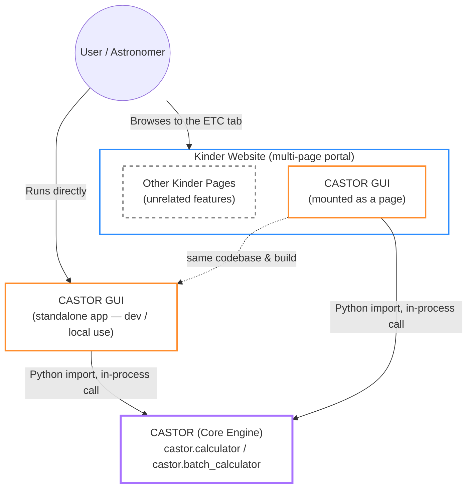
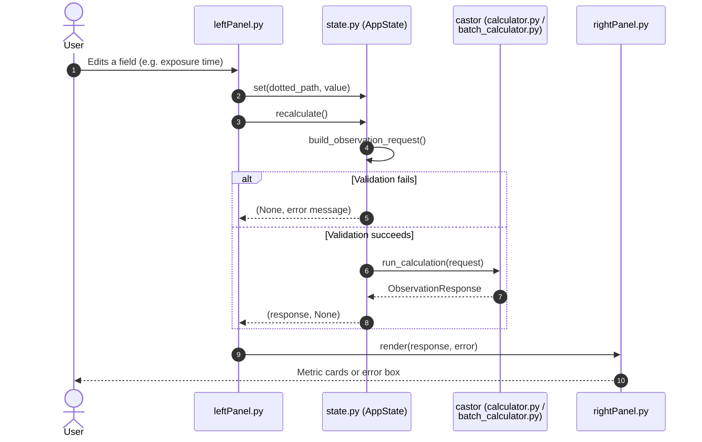

# CASTOR GUI Architecture

## 1. System Overview

### 1.1 Product Identity

CASTOR GUI is the official reference interface for the [CASTOR](architecture.md) exposure time calculator engine. It is a Flet-based Python application that gives astronomers a full, form-driven UI for building an observation request (instrument, target, environment, calculation strategy), running the calculation live, and reading back the results — without writing any code or touching `castor.schema` directly.

It ships as a standalone desktop/web app first (what you get running `castorGUI` locally), and the same build is designed to be **mounted as a page inside [Kinder](https://kinder.astro.ncu.edu.tw)** — a larger, multi-tab astronomy portal — rather than distributed as its own separately-branded site. In other words: Kinder does not reimplement the calculator's UI; it mounts CASTOR GUI's page and everything astronomers see there is the same interface verified in this standalone app.

Per an early mockup from the team (not yet a locked spec), the mounted page is reached from Kinder's own top-level `TOOLS` navigation menu and is branded **"CASTOR ETC — Optical Exposure Time Calculator Engine"** within the page itself, distinct from the Kinder site name shown in the nav bar above it.

CASTOR GUI is a distinct product from the CASTOR core engine. It is a consumer of that engine, not part of it — see [`architecture.md` §1.3](architecture.md#13-system-context--boundary) for the engine-side boundary. This document describes CASTOR GUI on its own terms.

### 1.2 Core Value

Without CASTOR GUI, every consumer of the CASTOR engine (Kinder's backend, other scripts) has to build its own form, its own validation-error display, and its own results layout from scratch, against a Pydantic contract that changes as the engine evolves. CASTOR GUI centralizes that work once, correctly, and lets Kinder mount it instead of re-deriving it — while still doubling as the fastest way for the CASTOR team to manually exercise the engine during development.

### 1.3 System Context & Boundary

CASTOR GUI talks to the engine exactly like any other caller: it imports `castor.calculator`, `castor.batch_calculator`, and `castor.schema` as a plain Python library and calls them in-process (see [`state.py`](../src/castorGUI/state.py)). It holds no special access the engine doesn't also grant to Kinder or any other integrator.



Two deployment shapes, one codebase: locally the CASTOR team runs CASTOR GUI standalone to develop and verify against the engine; in production the same app is mounted as one page inside Kinder's larger site rather than being its own destination astronomers navigate to directly.

**Chrome vs. content ownership:** when mounted, Kinder owns only the outer site chrome — its top nav bar (`MARSHAL` / `TOOLS` / `PLANNERS` / `ABOUT US` / `LOGIN`) and whatever routing gets a user to the page. Everything inside the content area belongs to CASTOR GUI, *including its own visual identity* — the dark background and gold `#C5A059` accent defined in [`constant.py`](../src/castorGUI/constant.py)'s `Design` tokens travel with the product rather than being re-skinned to match Kinder. Kinder frames it; it doesn't restyle it.

#### In Scope for CASTOR GUI

##### A. Request Building

* **Domain-Driven Form:** Four tabs — Instrument, Target, Environment, Options — mirroring the engine's four request pillars, each editing a dotted-path slice of `AppState` (see [`state.py`](../src/castorGUI/state.py)).
* **Hardware Presets:** Loading and applying named telescope/camera/filter presets from [`data/presets.json`](../src/castorGUI/data/presets.json) so common configurations don't need to be retyped.
* **Save / Load:** Serializing the current form state to/from JSON, independent of the engine's own request/response schema.

##### B. Live Calculation & Results Display

* **Single-Point Mode:** Recalculates via `castor.calculator.run_calculation()` on every field edit and renders SNR/exposure results, the signal & noise budget, physical diagnostics, and observation limits as metric cards ([`rightPanel.py`](../src/castorGUI/rightPanel.py)). The interaction model — freely-switchable tabs with instant recalculation on every edit, not a gated step-by-step wizard — is intentional and is what's meant to carry into the mounted Kinder page as-is; CASTOR GUI was built specifically to become that page, so its existing UX *is* the target UX, not a placeholder for one. (An early team mockup rendered the tabs as numbered, sequentially-gated steps — that reflects the mockup's own rough layout, not an intended interaction change.)
* **Error & Warning Surfacing:** Translating Pydantic `ValidationError`s and engine-level `ValueError`s into readable messages instead of crashing the app; surfacing physical-boundary warnings (e.g. saturation, high airmass) inline.
* **Batch / Time-Series Mode (planned):** Driving `castor.batch_calculator.run_batch_calculation()` and rendering its array output as a curve (e.g. SNR over a night, or over exposure time) rather than single-point metric cards — see §5 Future Extensibility.

##### C. Visual Presentation

* **Its own design system:** Colors, spacing, and typography ([`constant.py`](../src/castorGUI/constant.py)) — this is exactly the kind of UI ownership `src/castor/` explicitly stays out of.

#### Out of Scope for CASTOR GUI

##### A. Physics & Validation Logic

* **No Independent Calculations:** CASTOR GUI never computes SNR, exposure time, or any physical quantity itself — every number displayed comes from a `castor` engine call. It contains no copies of formulas from `physics.py` or `moon.py`.
* **No Relaxed Validation:** It does not work around or loosen the engine's Pydantic contract; invalid input is rejected by the same `StrictModel` rules the engine enforces on any other caller.

##### B. Backend & Persistence Concerns

* **No Auth, No Multi-User State:** Accounts, sessions, and permissions are Kinder's responsibility once CASTOR GUI is mounted inside it — this app has no login and no per-user data.
* **No Canonical Preset Database:** [`data/presets.json`](../src/castorGUI/data/presets.json) is a local convenience file for standalone/dev use, not a production source of truth — when mounted inside Kinder, presets are expected to come from Kinder's own hardware database instead.
* **No Networking of Its Own:** It does not expose an HTTP API; it is a client, and it reaches the engine only via direct, in-process Python calls.

## 2. Component Architecture

```text
src/castorGUI/
├── app.py            # Entry point: wires AppState + LeftPanel + RightPanel into one page
├── state.py           # AppState — form data store, presets, schema (de)serialization
├── leftPanel.py         # Input forms: Instrument / Target / Environment / Options tabs
├── rightPanel.py          # Results display: metric cards, error/warning boxes
├── constant.py              # Design tokens — colors, spacing, typography
└── data/
    └── presets.json           # Local dev hardware presets (see §1.3.B out-of-scope note)
```

### Module Responsibilities

* **`app.py`:** Boots the Flet page, constructs `AppState`, `LeftPanel`, and `RightPanel`, and wires the recalculate-on-change callback between them. Runs one calculation up front so the results panel isn't empty on first paint.

* **`state.py`:** The single source of truth for form data. Exposes dotted-path `get`/`set` access matching the engine schema's nested shape, builds a validated `castor.schema.ObservationRequest` from that dict, and calls `run_calculation()`. Converts any `ValidationError`/`ValueError` into a display-ready string rather than letting it propagate. Also owns preset application and JSON save/load (deep-merge, so old save files missing newer fields don't blow away current defaults).

* **`leftPanel.py`:** Renders the four-tab input form and keeps every field bound back into `AppState`, triggering recalculation on change.

* **`rightPanel.py`:** A pure render target — no buttons, no state of its own. Takes whatever `AppState.recalculate()` returns and either draws metric cards or an error message.

* **`constant.py`:** Centralizes the `Design` token set (colors, spacing, radii, typography) so visual styling isn't scattered as magic values across the panel files.

## 3. Design Principles

### 3.1 Thin Client Over the Engine

CASTOR GUI holds no physics and no independent validation rules — it is a rendering and input-collection layer over `castor`. Every calculation result traces back to a single `run_calculation()` / `run_batch_calculation()` call; this keeps the GUI and the engine from ever silently disagreeing about a number.

### 3.2 Same Contract as Any External Caller

The GUI is deliberately not given a private/faster path into the engine. It builds the exact same `ObservationRequest` / `BatchObservationRequest` Pydantic objects any other integrator (like Kinder's backend) would build, so behavior verified in the GUI transfers directly to other callers.

### 3.3 Standalone-First, Mount-Ready

The app is built and tested as a fully working standalone program, not as a fragment that only makes sense embedded in Kinder. Mounting inside Kinder is an additional deployment target for the same build, not a different codebase.

## 4. Data Flow



## 5. Future Extensibility

* **Batch / Time-Series Visualization:** A results view backed by `castor.batch_calculator.run_batch_calculation()`, plotting its array output (e.g. SNR across a night, or across accumulated exposure time) instead of single-point metric cards. This is the natural home for the "SNR to Exposure Time"-style chart — it reuses the existing Instrument/Target/Options tabs and only needs the Environment tab to grow a time-series variant (start/end/step in place of a single `observing_time_utc`), plus a chart-rendering results view alongside the existing metric-card one.
* **Kinder Mounting Mechanism:** Confirmed shape is a page under Kinder's `TOOLS` menu, branded "CASTOR ETC", with Kinder owning only the outer nav chrome and CASTOR GUI owning the full content area (see §1.3). The concrete technical integration (iframe, Flet web export served from a Kinder route, or another embedding approach) is not yet decided.
* **Preset Source Swap:** Replacing the local `data/presets.json` with Kinder's hardware database once mounted, while keeping the JSON file as the standalone/dev fallback.
